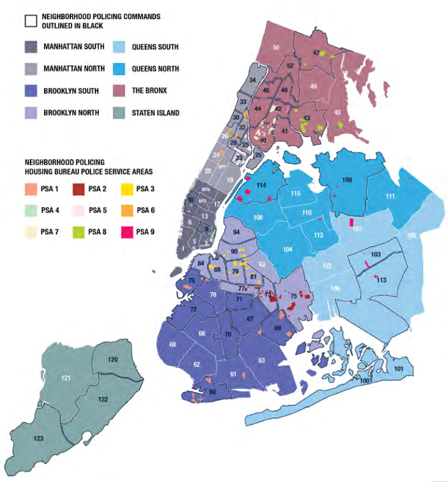

```{r setup, include=FALSE}
knitr::opts_chunk$set(echo = TRUE)
```

These `.Rmd` files represent the project submission for the course [Statistical Inference and Learning](https://www.unive.it/data/course/521944) by Professor [Cristiano Varin](https://www.unive.it/data/people/5592728) at [Ca' Foscari University of Venice](https://www.unive.it/) for the year 2025/2026.

# Problem Statement

## Goal of the Project

As the title of the project suggests, the goal of the project is to assess **whether** we can affirm that the **police behavior shows excessive enforcement patterns**, after a vehicle stop has been conducted.

In particular, we focus on studying if there exist **relationships between arrests specific groups of people**, time frames, or areas. This should help to shed some light on the alleged "systemic nature" of the stops.

However, some of the limiting factors for our study include:

- The small window of time used to gather the data (around 3ys and 3 months);
- The absence of information about the reason behind the halt;
- The self-report nature of some variables and the partial anonymization of the values.

Thus, this analysis will not be limited to performing basic univariate, bivariate or multivariate exploratory analysis. Instead, we first **start from formatting/converting the data** in a way we can understand the meaning of each variable, and the issues that come with it.

Furthermore, we may also **introduce transformations** or other means of engineering, until we feel satisfied with the final dataset. Adding new insights about the effects of, say, time-of-day, day-of-week and precinct, may help to reveal hidden patterns.

All of the manipulations, are to be carefully tested for their impact. In fact, we might end up using some automatic variable selection approach to and other means of **model selection**.

Only then, we can proceed to design the final plot, check for outliers and collinearity, and formulate our main assumptions. We will start with simple models and only introduce interactions when justified by performance or domain reasoning. This does not mean we are not going to try and evaluate combinations of predictors (that may also substitute the initial ones) nonetheless. The result of this initial part, aims to increase the reliability of the information, crucial to the next step.

The core of this project is to **pragmatically build**, analyze and interpret (multiple) **predictive models** capable of estimating **whether a stop originates from a vehicle check point**, **whether it escalates into an arrest** and the importance of the factors used to build such models. This means, we want to differentiate between different target predictors by context, and build two different datasets for separate analyses.

Therefore, this requires an extensive training process, including the use of k-fold-cross validation, subset selection and other techniques to promote theoretical and empirical validity.

Finally, as this is **mainly a classification problem**, we will include all possible classification metrics and perform extensive tests. We hope to quantify both the accuracy and the confidence of our inferences to determine what this data is telling us.

## Previous Research and Novel Approach

Even though there exist some public reports (e.g., [NYCLU - NYPD Vehicle Stops Data](https://www.nyclu.org/data/nypd-vehicle-stops-data)), they only cover descriptive statistics. Plus, we focus on 2 particular responses and not all possible targets.

As already stated above, our analysis will provide a better insight, through predictive modeling, model comparison (for instance, via AIC and cross-validation), and inference on interactions (e.g., ethnicity x time or precinct).

We hope this analysis dissipates or pinpoints the police bias clearly, even with limited data, as it might lead to either confirming that some areas and ethnicities are more subject to police enforcement than others, or that this has been a product of the prominent propaganda, and the police is "just doing its job".

## Questions we want to ask

Obviously, we could not proceed forward if we did not have some designated questions for our data.

**Is it more likely to be the subject of an arrest **...

- When stopped in a specific area (or borough)?
- When stopped during a specific time bracket (ex: 0am-3am)?
- When stopped during a specific day of the week or weekend (ex: Saturday/Sunday)?
- If the driver is under 35 years old or if they belong to a specific age bracket (ex: 18-24)?
- If the driver belongs to a specific reported ethnicity?
- If the driver identifies with a specific reported sex?
- If the vehicles used belongs to a specific category (ex: 2-Wheels vs 4-Wheels)?

Furthermore, we may also formulate questions of the kind:

- Is there a specific sub-category of drivers (grouped by reported sex and/or reported ethnicity and/or reported age) that is subject of most of these episodes?
- Is there a specific reported ethnicity targeted by excessive enforcement behavior in a particular area/borough?

Finally, these questions will be refined as we proceed with exploration and analysis.

## Goal of this rmarkdown file

The ultimate goal of this file is to build a dataset ready for EDA (Exploratory Data Analysis) by showing a preview of the main issues encountered, and motivating the eventual modification of the original data.

This includes

- Environment Creation, to prepare the dependencies for the R packages used;

- Data Overview, to show how the original data looks like;

- Type Conversion, to match the original purpose (and format) of the predictors with the R environment (without loss of consistency);

- Initial Feature Engineering, to create new predictors that may be better suited for our analysis and to modify their value range when possible (ex: merging very rare categories);

- Feature Removal, to drop predictors that may negatively affect our models or that are known to lead to over-fitting/under-fitting;

- Initial Data Coherency Check, to ensure that the actual range of values matches what we expect;

- Initial Data Cleaning, to remove rows that show obvious outliers and extremely rare categories/values;

- Initial Data Correction, to impute missing values and to modify inconsistent ones, by exploiting the correct portion of the data or using other predictors (which may contain similar info).

Note that, from now on, I will shift to a more **formal or inclusive tone** (e.g., the "editorial we").

------------------------------------------------------------------------

# Environment

The first thing to do, is to build a reproducible environment for our project.

```{r requirements-list}
requirements=c( 
  "remotes", "summarytools", 
  "stringr", "plyr", "dbplyr", "dplyr", "dtplyr", "tidyr", "tidyselect",
  "timeDate", "timechange", "tzdb", "hms", "readr",
  "lubridate", "prettyunits", "RColorBrewer", "viridis", "rcartocolor", "ggbeeswarm", "emmeans",
  "sf", "plotly", "ggplot2", "ggmap", "ggdensity", "UpSetR", "patchwork"
)
```

```{r install-requirements, include=FALSE}
for (req in requirements){
  if (!require(req, character.only = TRUE)){
      install.packages(req)
  }
}
```

Note that some of the packages may not be used, but to avoid any error related to dependencies, we are going to keep all of these libraries. Now, the loading of all packages should be immediate.

```{r load-requirements, include=FALSE}
for (req in requirements){
  if (!require(req, character.only = TRUE)){
      library(req)
  }
}
```

```{r remove-vars, include=FALSE}
rm(requirements, req)
```

------------------------------------------------------------------------

# Data Overview

Here we try to introduce the data, elaborate on its nature and make hypothesis about its usability and quality. Part of the process requires us to make some assumptions and apply some decisions, otherwise it would not be possible to alter the data at all.

## Data Description

The dataset was published during February 27th 2024, by the NYPD, which describes the data as "Police incident level data documenting vehicular stops". Also, it was updated in April 28th 2026 and downloaded less than 13000 times at the time of download (End of May 2026).

Let us load the data now.

```{r load-data}
vehiclestops = read.csv("data/NYPD_Vehicle_Stop_Reports_20260529.csv")
```

The [data overview landing page](https://data.cityofnewyork.us/Public-Safety/NYPD-Vehicle-Stop-Reports/hn9i-dwpr/about_data) confirms that the number of rows are 2.7M+ rows and has 19 columns

```{r dim-data}
dim(vehiclestops)
```

From the same source, we can gather the following information that we present as a small recap table for the predictors:

| **Column Name** | **Description** | **Data Type** | **Format** | **Optional** | **Notes** |
|------------|------------|------------|------------|------------|------------|
| `EVNT_KEY` | Unique identifier | Text | Large integer | No |  |
| `OCCUR_DT` | Date of occurrence | Floating Timestamp | MM-DD-YYYY | No |  |
| `OCCUR_TM` | Time of occurrence | Text | HH:MM:SS | No |  |
| `CMD_CD` | Command code | Text | A 3 character numeric descriptor (001 = 1st precinct) | No | Related to officers command or permanent assignment. |
| `VEH_SEIZED_FLG` | Vehicle seizure flag | Checkbox | Y/N | Yes | May result in null values. |
| `VEH_SEARCHED_FLG` | Vehicle searched flag | Checkbox | Y/N | Yes | May result in null values. |
| `VEH_SEARCH_CONSENT_FLG` | Vehicle searched consent given flag | Text | Y/N | Yes | May result in null values. |
| `VEH_CHECKPOINT_FLG` | Vehicle checkpoint conducted flag | Checkbox | Y/N | Yes | May result in null values. |
| `FORCE_USED_FLG` | Force used flag | Checkbox | Y/N | Yes | May result in null values. |
| `ARREST_MADE_FLG` | Arrest made flag | Checkbox | Y/N | Yes | May result in null values. |
| `SUMMON_ISSUED_FLG` | Summons issued flag | Checkbox | Y/N | Yes | May result in null values. |
| `VEH_CATEGORY` | Vehicle category | Text | String (ex: CAR/SUV) | No |  |
| `RPTED_AGE` | Motorist reported age | Text | Digits/Unknown | No | Self-Reported. |
| `SEX_CD` | Motorist sex | Text | M/F/U | No | Self-Reported. |
| `RACE_DESC` | Motorist race | Text | String/Other/Unknown (ex: White) | No | Self-Reported. |
| `LATITUDE` | Anonymized latitude | Number | Floating point | No | May result in 0 values. |
| `LONGITUDE` | Anonymized longitude | Number | Floating point | No | May result in 0 values. |
| `X_COORD_CD` | Anonymized X coordinate code | Number | Integer | No | May result in 0 values. |
| `Y_COORD_CD` | Anonymized Y coordinate code | Number | Integer | No | May result in 0 values. |

## Predictors Overview

Let us see how this would be represented in `R` with a quick summary, and then we can comment on it and make some assumptions or hypothesis to test later:

```{r summary-data}
print(dfSummary(vehiclestops), method="render")
```

### At first glance

The **format and type of the data needs to be re-thought**.

Some of the predictors that were meant to be "checkboxes" are not consistent in values. For instance, `VEH_SEIZED_FLG` has type `character` and possible values `true` or `false` , while `VEH_SEARCH_CONSENT_FLG` has the same type, but possible values `Y` or `N` . For these predictors, we will need to create a homogeneous boolean representation (such as using factors). It would not be much of an issue if it was not for the fact we have many nominal variables.

For what concerns the numerical predictors, they come in a limited quantity, adding another layer of problems to our final goal. We are used to find perfectly modeled datasets from the moment of the download, while here we have to face the harsh reality that we must be the ones to bend the data to our needs.

Overall, dealing with such a representation is already a challenge, and we must take into account that cleaning and adapting the data will require some patience. The good news is that the presence of many instances can help us impute some of the missing data. In fact, this might help us avoid removing rows and columns, an approach that reduces the amount of reliability we can attribute to this analysis.

### Dropping Row ID and Extra Targets

We can make an exception for `EVNT_KEY`, as it is a row identifier, not a predictor. In fact, it is irrelevant from our point of view, while also introducing a substantial "leakage risk" that can mislead our models.

```{r remove-evnt-key}
vehiclestops <- vehiclestops %>% select(-EVNT_KEY)
```

Since we **are focusing on arrests**, we took the decision to remove predictors that really represent other possible targets and may affect the interpretation. To justify this, we must consider that it is not possible to deliver a coherent analysis that also takes into account all the possible escalation interpretations. Further motivations will be later introduced.

```{r remove-extra-targets}
# Remove SUMMON_ISSUED_FLG
vehiclestops <- vehiclestops %>% select(-SUMMON_ISSUED_FLG)

# Remove VEH_SEARCH_CONSENT_FLG
vehiclestops <- vehiclestops %>% select(-VEH_SEARCH_CONSENT_FLG)

# Remove VEH_SEARCHED_FLG
vehiclestops <- vehiclestops %>% select(-VEH_SEARCHED_FLG)

# Remove VEH_SEIZED_FLG
vehiclestops <- vehiclestops %>% select(-VEH_SEIZED_FLG)

# Remove FORCE_USED_FLG
vehiclestops <- vehiclestops %>% select(-FORCE_USED_FLG)

# Remove VEH_CHECKPOINT_FLG
vehiclestops <- vehiclestops %>% select(-VEH_CHECKPOINT_FLG)
```

### Feature Renaming

Furthermore we are going to rename some predictors with low case letters and shorter labels.

```{r feature-renaming}
# OCCUR_DT -> date
vehiclestops <- rename(vehiclestops, date = OCCUR_DT)

# OCCUR_TM -> time
vehiclestops <- rename(vehiclestops, time = OCCUR_TM)

# CMD_CD -> command
vehiclestops <- rename(vehiclestops, command = CMD_CD)

# ARREST_MADE_FLG -> arrested
vehiclestops <- rename(vehiclestops, arrested = ARREST_MADE_FLG)

# VEH_CATEGORY -> veh_categ
vehiclestops <- rename(vehiclestops, veh_categ = VEH_CATEGORY)

# RPTED_AGE -> age
vehiclestops <- rename(vehiclestops, age = RPTED_AGE)

# SEX_CD -> sex
vehiclestops <- rename(vehiclestops, sex = SEX_CD)

# RACE_DESC -> ethnicity
vehiclestops <- rename(vehiclestops, ethnicity = RACE_DESC)

# LATITUDE -> latitude
vehiclestops <- rename(vehiclestops, latitude = LATITUDE)

# LONGITUDE -> longitude
vehiclestops <- rename(vehiclestops, longitude = LONGITUDE)

# X_COORD_CD -> x_coord
vehiclestops <- rename(vehiclestops, x_coord = X_COORD_CD)

# Y_COORD_CD -> y_coord
vehiclestops <- rename(vehiclestops, y_coord = Y_COORD_CD)
```

You must have noticed, we changed a predictor's name from "RACE_DESC" to "ethnicity". While it is true that "race" usually refers to physical appearances and not cultural heritage, its self-reported nature makes it closer to the definition of latter. Furthermore, talking about "race" in 2026 may be appropriate for dogs, but not for humans who all belong to the same species.

The dataset is definitely better looking

```{r summary-data-2}
head(vehiclestops)
```

Now let us elaborate on the remaining predictors by "macro-category", so that we have a clear idea of their meaning, the issues they come with and possible hints for feature engineering.

### Predictors related to Dates and Time

These predictors are very important because they will be crucial, along with geographical ones, to obtain part of the **circumstances that precede the stop**.

Although the first step, regarding `date` and `time`, should be to split the values and turn them into separate integer predictors for each unit, we also take into account the greater globular information that derives from aggregating multiple values.

In fact, by extracting the hour predictor (from the date) it is possible to create a new categorical predictor that **groups different time frames of the day with a label** (ex: assigning "early-morning" to time between and 5 AM and 7 AM). The main motivation behind this, is fact that hours, minutes or seconds alone may be good for visualization but they could be too fine-grained. This kind of feature engineering may prove more meaningful than representing time as a numerical predictor, as its behavior is circular, but we will have to assess this later.

However, there is a caveat: the data spans throughout 3 years and three months (from beginning of 2023, to end of March 2026). This is one of the constraints that we cannot remove, but the volume of the data will still help us back up our claims in the end.

For future analysis, we should also dig into the NY community life and reveal the presence of manifestations, construction works and other aspects that can help us explain the patterns we are going to see.

### Geospatial Predictors

Geospatial predictors like `latitude`, `longitude`, suffer from some **lack of information**. In fact, without checking null or 0 values, there is already around 7.4% of missing data. Also, there is evidence of errors in the range of `x_coord` and `y_coord`, which should not have values like `-74` or `40`. This indicates a mix-up with the previously mentioned columns. Fortunately, it is possible to convert one into the other and viceversa.

For what concerns the presence of 0 values in `latitude` and `longitude`, we guessed that it might depend on **whether the stop occurred at a fixed location (checkpoint) or not** (like a patrol stop or traffic violation observed in motion). In our case, we have to discard this other target because the analysis becomes extremely long.

Thus, some could argue that it was the result of an anonymization of the location, as we are dealing with sensitive or standardized information. On the other hand it could be due to how the data is managed by the system: officers (on the checkpoint location), or an automatic system, might just fill the data for one stop, while the remaining ones are simply set to 0.

Unfortunately, we are going to limit the usage of geospatial predictors for data visualization and discard them when it comes to building models as they are known to lead to overfitting. However, this does not mean we cannot exploit higher level information, which we are going to talk about next.

### Predictors related to Command Units, Precincts and Jurisdictions

Trivially, the first predictor that comes to mind when looking for a less fine-grained spatial predictor is `command`.

However, it serves more as a mean to represent **behavior** rather than being an indicator for location: it tells us **who made the stop and, by extension, how their command might influence stop patterns through policies**. Obviously, this is not easy to formalize as it may involve aspects such as the internal enforcement philosophy of a given command (such as aggressive vs. community engagement) or the mission of the unit (e.g., traffic safety, gang enforcement, narcotics, ...).

This makes `command` a **powerful signal, but also a highly confounded one**. We need to be cautious to avoid the scenario where it encodes systemic enforcement bias. Namely, if our models rely too heavily on this variable, we risk to learn and *amplify patterns that may already be skewed*. Plus, since we already have geospatial data, we need to verify whether `command` adds non-redundant information or simply repeats what is already captured in those predictors, which may introduce multicollinearity.

Last but not least, the phenomenon of *data drift* adds another layer of complexity: if precinct behavior evolves over time, the predictive power of `command` might not hold up in future data (although this something that is out of our hands).

Therefore, **we plan to combine it, along with geospatial predictors and domain knowledge, in order to produce more reliable predictors** such as neighborhoods and areas.

### Enforcement-related Predictors and Class Imbalance Issues

Although there is an intuitive escalation, we **avoid modeling it as ordinal due to lack of causal structure**. What do we mean by this?

When we talk about escalation, we consider being stopped by the police the starting point, followed by a search and/or the use of force. It **would be natural for the climax to be the seizure of the vehicle and the arrest of the driver**. However, the actual relationships between these outcomes **are not ordinal by default**. Unfortunately, **we also lack transparent information about the "probable cause" for the stop**, which would surely rule out some of the possible outcomes. As the [NYPD Monitor](https://www.nypdmonitor.org/know-your-rights/) states "An officer can stop a car if they have probable cause that the driver and/or occupants have committed or are committing a crime or a traffic violation or reasonable suspicion of a felony or NYS Penal Law misdemeanor".

Without any idea about what the police is looking for when conducting an halt, we should find a way to infer when their behavior become "excessive". This means we must treat each flag (e.g., search, seizure, use of force, arrest) as a separate event with its own conditions, rather than parts of a single unfolding sequence, and dig deeper into common patterns behind each one of them. Unfortunately, as remarked before, we are not going to do this as it is time consuming and intricate.

To further depict why this seems complicated, let us look at the arrests: they occur in only `3.4%` of cases, a very rare event compared to the amount of instances (class imbalance). In contrast, judicial summonses appear in `59.2%` of rows, and are far more common (i.e. less likely to show any particular bias). The remaining possible outcomes happen in less than `3%` of the total stops.

By our line of conduct, this preview may let us believe there is no such thing as excessive enforcement behavior in NYPD, but raw frequencies are misleading and this is not our goal. Furthermore, we want to show our commitment in telling a precise story about the data, and this requires simplifying the environment of our research to some level.

### Motorist-related Predictors

When working with *self-reported demographic* predictors (age, sex, and ethnicity), we try to pay close attention because they **carry both behavioral context and potential bias**.

The `age` field, for instance, allows us to **segment drivers into age brackets** (like we would do for the time of the day). This idea comes from the fact, the preview highlights a good amount of stops involved people under 30 years of age. Thus (with a new representation) we might be able to confirm whether younger drivers are treated differently, such as being more likely to get arrested. More interesting aspects will emerge later on.

For `sex`, we usually treat it as a binary or categorical variable, but the presence of `unknown` as a possibility may suggest that the form used by police officers is not "inclusive". By not being able to represent people that do not identify themselves with traditional labels "Male" or "Female", `15680` records are left with this ambiguous value. Unlike other numerical data, we have no means to impute this information, although our first thought would be assuming these persons are part of the LGBT+ community. On the other hand, the self-reported nature of the variable does not help us understand if the data was exploited by the motorist to take advantage of the line of defense that involve minorities, so we must take a faith leap on that. Anyway, we cannot just assume people belong to the LGBT+ community (even if we could check the statistics regarding the month of July, the international pride month), nor that they are always honest (especially with the police).

The `ethnicity` variable is particularly important for identifying possible disparities. However, it is hard to understand how to approach the fact we have `8116` instances of `OTHER` values and `225975` of `UNKNOWN` values. They represent almost `10%` of the total data, and it seems hard even to distinguish between the meaning of other and unknown as labels. Again, this might be an attempt of forgery as a response to fear of police enforcement, but we can only make a weak assumption about this. We could pair the `UNKNOWN` and `OTHER` values for sex, age and ethnicity, to infer that this was an attempt to confound the stop agent, but it is hard to assess with certainty. Alternatively we can just merge rare categories in all predictors and discard extremely rare ones. We will see more about this later on.

Even if it is not counted as motorist-related, `veh_category` can be associated with the reasons behind a stop. For example, some officers may perceive young adults driving high-performance or "flashy" cars as reckless, or may hold biased views toward Black or Hispanic drivers behind the wheel of certain vehicles.

### Further considerations

The comments, feature engineering and data preparation ideas mentioned in these sections are going to be explored in the remaining part of this file, without demanding completeness (some were just naive ideas). We are aware of the fact, this was only a preview and that we need to switch to more detailed means of analysis.

Finally, as much as we would like to join different datasets to this one (like [NYPD Use of Force Incidents](https://data.cityofnewyork.us/Public-Safety/NYPD-Use-of-Force-Incidents/f4tj-796d/about_data) or [Moving Violation B Summons](https://data.cityofnewyork.us/Public-Safety/Moving-Violation-B-Summons-Historic-/bme5-7ty4/about_data)), it requires a very tough and long job, even though we might be able to dig deeper on the matter. This is a consideration to make for future analyses.

------------------------------------------------------------------------

# Initial Feature Engineering

We can formulate some high level hypothesis to abstract from underlying relationships and engineer new predictors that might help us later. The goal is to fine-grain or generalize the meaning conveyed by the initial predictors. As stated above, we wondered about the age bracket that might be more concerned with excessive use of force.

Thus, we proceed with this approach guided by intuition, and we will test in the EDA our new features to see whether we might have to adjust some aspects or remove them completely.

## Date and time related features

We want to first convert the date into a proper format, for this task: the American format.

```{r date-conversion}
# Convert date to proper date
vehiclestops$date <- as.Date(vehiclestops$date, format = "%m/%d/%Y")
```

### Splitting the date into day, month, year and adding the day of the year

Then, we split the date into each unit of time available.

```{r date-split}
# Split year
vehiclestops$year <- year(vehiclestops$date)

# Split month
vehiclestops$month <- month(vehiclestops$date)

# Split day
vehiclestops$day <- day(vehiclestops$date)
```

And we add the day of the year for visualization purposes.

```{r create-doy}
# Add day-of-year (1-366 because of lap year)
vehiclestops$doy <- yday(vehiclestops$date)
```

### Splitting the time of occurrence into hour and minutes

Again, we split the time into each unit.

```{r time-split}
# Split hour
vehiclestops$hour <- as.numeric(sapply(strsplit(vehiclestops$time, ":"), `[`, 1))

# Split minute
vehiclestops$minute <- as.numeric(sapply(strsplit(vehiclestops$time, ":"), `[`, 2))
```

### Adding Week days

Now let us add

- A categorical variable that indicates the name of the day as `weekday`,
- The `dow` or "day of the week" which is the related integer number(1-7),

```{r add-weekday-dow-weekend}
# Get days in american format
vehiclestops$weekday <- factor(
  wday(vehiclestops$date),
  levels = 1:7,
  labels = c("Sunday", "Monday", "Tuesday", "Wednesday", "Thursday", "Friday", "Saturday")
)

# Order in ISO format
vehiclestops$weekday <- factor(vehiclestops$weekday,
  levels = c("Monday","Tuesday","Wednesday","Thursday","Friday","Saturday","Sunday"),
  ordered = TRUE
)

# Add day of the week
vehiclestops <- vehiclestops %>%
  mutate(
    dow = case_when(
      weekday == "Monday" ~ 1L,
      weekday == "Tuesday" ~ 2L,
      weekday ==  "Wednesday" ~ 3L,
      weekday ==  "Thursday" ~ 4L,
      weekday ==  "Friday" ~ 5L,
      weekday ==  "Saturday" ~ 6L,
      weekday ==  "Sunday" ~ 7L,
      TRUE ~ NA_integer_
    )
  )
```

### Introducing time-brackets

Last but not least, we now try to use the time to build the time bracket (we talked about earlier) for the time of the day:

- **Late night**: 0–3
- **Early morning**: 4–7
- **Morning commute**: 8–11
- **Midday**: 12–15
- **Afternoon / early evening**: 16–19
- **Night**: 20–23

This should capture the night life, rush hour and the 9-5 window well.

```{r add-time-bracket}
# First convert into minutes
vehiclestops$mins <- vehiclestops$hour * 60 + ifelse(is.na(vehiclestops$minute), 0, vehiclestops$minute)

# Set the binning values according to mins
vehiclestops$time_bracket <- cut(
  vehiclestops$mins,
  breaks = c(-1, 240, 480, 720, 960, 1200, 1440),
  labels = c("Late night (0–3)", 
             "Early morning (4–7)", 
             "Morning commute (8–11)", 
             "Midday (12–15)", 
             "Afternoon/evening (16–19)", 
             "Night (20–23)"),
  right = TRUE
)

# Ordered factor
vehiclestops$time_bracket <- factor(
  vehiclestops$time_bracket, 
  levels = c("Late night (0–3)",
             "Early morning (4–7)",
             "Morning commute (8–11)", 
             "Midday (12–15)",
             "Afternoon/evening (16–19)",
             "Night (20–23)"),
  ordered = TRUE
)

vehiclestops <- vehiclestops %>% select(-mins)
```

In case we find out about a better way to group them, we will modify this feature in the EDA, and the same goes for other kinds of grouping.

## Motorist related features

### Introducing Age Bracketing

Although, age bracketing is a bit subjective, in criminology and traffic safety research there are some conventions we can borrow to add more meaning to the age:

- **\<18**, *Underage drivers* (possible in the USA).
- **18–24**, *Young adults* (usually perceived as the highest risk-taking).
- **25–34**, *Early adults* (still younger drivers).
- **35–44**, *Mid adults*.
- **45–54**, *Older mid adults*.
- **55–64**, *Pre-retirement group*.
- **65+**, *Seniors* (sometimes higher stop rates due to cautiousness or strange behavior).

For what concerns missing values we are going to dedicate an `Unknown` label. We are not going to start removing instances of drivers over 100 years old even if they are to be considered very rare cases or attempts of forgery. This will be done later.

```{r add-age-bracket}
vehiclestops <- vehiclestops %>%
  mutate(
    age_num = parse_number(
      as.character(age),
      na = c("", "NA", "N/A", "NULL", "(null)", "UNKNOWN", "Unknown", "U")
    )
  )

vehiclestops$age_bracket <- cut(
  vehiclestops$age_num,
  breaks = c(-Inf, 17, 24, 34, 44, 54, 64, Inf),
  labels = c("Under 18", "18–24", "25–34", "35–44", "45–54", "55–64", "65+"),
  right = TRUE,
  ordered_result = TRUE
)

# Add NA as a separate level = "Unknown"
vehiclestops$age_bracket <- addNA(vehiclestops$age_bracket)
levels(vehiclestops$age_bracket)[is.na(levels(vehiclestops$age_bracket))] <- "Unknown"
```

Now we are going to convert the age to a number rather than using it as character

```{r age-type-conversion}
vehiclestops <- vehiclestops %>%
  select(-age) %>%
  rename(age = age_num)
```

### Merging rare ethnical labels

The motivation behind this passage is that we have very rare categories that can benefit from being grouped together. Our idea is to merge `"AMERICAN INDIAN/ALASKAN NATIVE", "UNKNOWN", "OTHER"` as they make up around 10% of the total instances, when grouped together.

```{r count-rare-ethnical-labels}
vehiclestops %>%
  filter(
   ethnicity %in% c("AMERICAN INDIAN/ALASKAN NATIVE", "OTHER", "UNKNOWN")
  ) %>%
  count()
```

We are aware of the fact that merging `AMERICAN INDIAN/ALASKAN NATIVE` and `OTHER` may be consistent with our analysis, while including `UNKNOWN` may be risky because we might delete a signal that potentially supports forgery (given the self-reported nature) or other complex dynamics (such as the motorist fleeing the scene). While the two former labels are extremely rare, the latter may just represent the "absence" of an entry, but we cannot easily infer the reason behind that.

First, we look at the amount of `UNKNOWN` labels with respect to our targets.

```{r count-arrests-ethnicity-unknown}
vehiclestops %>%
  filter(
   ethnicity == "UNKNOWN" &
   arrested == "true"
  ) %>%
  count()
```

`2337` arrests were made. 

So both numbers seem really important to us, and when considering the merged labels we would get the following

```{r count-arrests-rare-ethnicities}
vehiclestops %>%
  filter(
   ethnicity %in% c("AMERICAN INDIAN/ALASKAN NATIVE", "UNKNOWN", "OTHER") &
   arrested == "true"
  ) %>%
  count()
```

We barely reach `2832` arrests, which seems a small number but not if we consider the proportion.

For the time being, we can decide to leave the label `UNKNOWN` as a separated category, and wait for the EDA to decide whether it is best for us to merge it with the `Other` category.

```{r group-ethnicity-categ}
vehiclestops <- vehiclestops %>%
  mutate(
    ethnicity = case_when(
      ethnicity == "BLACK" ~ "Black",
      ethnicity == "HISPANIC" ~ "Hispanic",
      ethnicity == "WHITE" ~ "White",
      ethnicity == "ASIAN / PACIFIC ISLANDER" ~ "Asian / Pacific Islander",
      ethnicity == "UNKNOWN" ~ "Unknown",
      ethnicity %in% c("AMERICAN INDIAN/ALASKAN NATIVE", "OTHER") ~ "Other",
      TRUE ~ NA_character_
    )
  )
```

### Cleaning and Merging vehicle categories

Based on what the NYPD documentation describes these means of transports, we believe they mean the following:

- `CAR/SUV` are the standard passenger vehicles.
- `MCL` stands for *motorcycle*.
- `BIKE` stands for *bicycle* (non-motorized).
- `TLC` stands for *Taxi & Limousine Commission* licensed vehicles (yellow cabs, green cabs or Uber/Lyft registered under TLC).
- `TRUCK/BUS` stands for commercial trucks and buses (delivery trucks and private buses).
- `OTHER` is the category used for any vehicle that does not fit the listed categories.
- `(null)` is used for missing entries.
- `MOPED` should be referring to small motorized scooter (with a smaller engine than motorcycles).
- `DBIKE` probably is used for *dirt bike* (typically used for off-road rides, and we do not know whether it is street-legal).

From this, we gather that we generally can distinguish between 4 wheels and 2 wheels, and between private and commercial vehicles. We **decide to focus exclusively on private vehicles**, which bring us to exclude the `TLC` and `TRUCK/BUS` categories. This includes removing `(null)` entries.

```{r drop-tlc-truck-null}
vehiclestops <- vehiclestops %>%
  filter(
    veh_categ %in% c("CAR/SUV", "MOPED", "BIKE", "MCL", "DBIKE")
  )
```

Now we can proceed with the grouping.

```{r group-veh-categ}
# Clean grouping
vehiclestops <- vehiclestops %>%
  mutate(
    veh_categ = case_when(
      veh_categ == "CAR/SUV" ~ "4 wheels",
      veh_categ %in% c("MCL", "MOPED", "DBIKE", "BIKE") ~ "2 wheels",
      TRUE ~ NA_character_
    )
  ) %>%
  filter(!is.na(veh_categ))
```

It makes sense to leave it as a categorical variable for visualization purposes.

## Command Units and Precinct related features

We previously started from the idea that the command unit was related from the a single patrol unit and then correct ourselves noticing the number of multiple stops performed by the same units at the same time (in different places). Thus, we want to try and understand whether this coincides with another version of the map of the NYC units, we found inside the [The Police Commisioner's Report of 2017](https://www.nyc.gov/assets/nypd/downloads/pdf/publications/pc-report-2017.pdf), which includes both the command units and an aggregation of them.



### Adding areas features from Command Units

We would like want to understand whether the command units coincide with the neighborhood/ precincts area in this picture and and be more specific about the area of the stop. Thus, let us pick, say the Staten Island command units, and hope they coincide.

```{r plot-staten-island-stops}
# Staten island cmd units
chosen_cmds <- c(120, 121, 122, 123)

# NYC bounding box
bbox <- c(xmin = -74.26, ymin = 40.48, xmax = -73.71, ymax = 40.92)
nyc_poly <- st_as_sfc(st_bbox(bbox, crs = st_crs(4326)))

# Filter out stops 
stops_sf <- vehiclestops %>%
  filter(!is.na(latitude), !is.na(longitude),
         latitude != 0, longitude != 0,
         command %in% chosen_cmds) %>%
  st_as_sf(coords = c("longitude","latitude"), crs = 4326)

# Convert command to factor for coloring
stops_sf$command <- factor(stops_sf$command)

ggplot(stops_sf) +
  geom_sf(aes(color = command), size = 0.4, alpha = 0.5) +
  scale_color_viridis_d(option = "turbo") +
  labs(color = "Command",
       title = "Vehicle Stops Colored by Command Code - Staten Island") +
  theme_minimal() +
  theme(legend.position = "right")
```

This confirms that the command unit corresponds exactly with the area of the jurisdiction. Thus, we can just use a grouping of the various precincts to insert a new feature with the name of each area! This might also represent better the behavior on a less fine grained scale.

```{r add-area}
staten_island_cmds <- c(120, 121, 122, 123) 
brooklyn_cmds <- c(60,61,62,63,66,67,68,69,70,71,72,73,75,76,77,78,79,81,83,84,88,90,94)
manhattan_cmds <- c(1,5,6,7,9,10,13,14,17,18,19,20,22,23,24,25,26,28,30,32,33,34) 
queens_cmds <- c(100,101,102,103,104,105,106,107,108,109,110,111,112,113,114,115,116)
bronx_cmds <- c(40,41,42,43,44,45,46,47,48,49,50,52)

vehiclestops <- vehiclestops %>%
  dplyr::mutate(
    area = dplyr::case_when(
      command %in% staten_island_cmds ~ "Staten Island",
      command %in% brooklyn_cmds ~ "Brooklyn",
      command %in% manhattan_cmds ~ "Manhattan",
      command %in% queens_cmds ~ "Queens",
      command %in% bronx_cmds ~ "Bronx",
      TRUE ~ "Unknown"
    )
  )
```

Even though there are 2 areas with the 114 command unit, we are going to aggregate it to queens. Evidently, not all the command units are there but this is good enough.

### Adding borough feature from command units

Last but no least, to allow for some "in between" kind of granularity we take inspiration from the same map and create the feature related to the grouped command units areas

Let us call it `boro` for borough

```{r add-boro}
north_brooklyn_cmds <- c(73,75,77,79,81,83,84,88,90,94)
south_brooklyn_cmds <- c(60,61,62,63,66,67,68,69,70,71,72,76,78)
north_manhattan_cmds <- c(19,20,22,23,24,25,26,28,30,32,33,34) 
south_manhattan_cmds <- c(1,5,6,7,9,10,13,14,17,18) 
north_queens_cmds <- c(104,108,109,110,111,112,114,115)
south_queens_cmds <- c(100,101,102,103,105,106,107,113,116)

vehiclestops <- vehiclestops %>%
  dplyr::mutate(
    boro = dplyr::case_when(
      command %in% bronx_cmds ~ "Bronx",
      command %in% north_brooklyn_cmds ~ "Brooklyn (North)",
      command %in% south_brooklyn_cmds ~ "Brooklyn (South)",
      command %in% north_manhattan_cmds ~ "Manhattan (North)",
      command %in% south_manhattan_cmds ~ "Manhattan (South)",
      command %in% north_queens_cmds ~ "Queens (North)",
      command %in% south_queens_cmds ~ "Queens (South)",
      command %in% staten_island_cmds ~ "Staten Island",
      TRUE ~ "Unknown"
    )
  )
```

```{r, include=FALSE}
rm(
  bbox, nyc_poly, stops_sf, chosen_cmds,
  staten_island_cmds, bronx_cmds, brooklyn_cmds, manhattan_cmds, queens_cmds,
  north_brooklyn_cmds, south_brooklyn_cmds, 
  north_manhattan_cmds, south_manhattan_cmds, 
  north_queens_cmds, south_queens_cmds
  )
```

## Target type conversion

Obviously, we cannot leave the features as the check boxes they represent, we must use a different approach. Since it is easier to use numerical variables initially, we will turn the categorical labels `"true/false"` to numerical ones `1/0`.

```{r numerical-arrested}
# Make numerical
vehiclestops$arrested <- case_when(
  vehiclestops$arrested == "true" ~ 1,
  vehiclestops$arrested == "false" ~ 0,
  vehiclestops$arrested == "(null)" ~ NA_real_,
  TRUE ~ NA_real_
)
```

## Current dataset

Here we show the results of what we did until now

```{r summary-current-dataset}
print(dfSummary(vehiclestops), method="render")
```

Of course the dataset is not completely polished yet. There will be further transformations, conversions and feature engineering in the EDA as we are going to plot and infer whether new features (for instance, interactors) can be engineered or some of the current ones can be removed.

------------------------------------------------------------------------

# Data Correction, Coherence Check and some Feature Engineering

Thankfully we do not have much to do here for missing data, a part from the geospatial data and the `age` predictor.

## Date and Time features

### Dropping date and time features

Since we managed to separate the values, we do no longer need these columns. The justification for removing `minute` is that we want to grasp more high-level patterns with our models, therefore either `hour` or `time_bracket` will suffice.

```{r drop-date-time}
vehiclestops <- vehiclestops %>%
  select(-date, -time, -minute)
```

## Geospatial features

From looking up online, we found out that are **latitude and longitude are geographic coordinates in WGS84 (EPSG:4326)**, while the x,y are **projected planar coordinates in NAD83** or New York Long Island (EPSG:2263). Basically, x and y are map projected coordinates in feet (not meters).

However, we are sure of the presence of many erroneous entries, because we already know that the bounding box for NYC (in terms of latitude and longitude) amounts to something like `(xmin = -74.26, ymin = 40.48, xmax = -73.71, ymax = 40.92)`.

```{r summary-latitude}
summary(vehiclestops$latitude)
```

As we can see, the minimum here is `0.00` when this is not possible. Furthermore, it is not a surprise the fact 19% of the values are missing.

Let us ignore the `0` values and consider the remaining range.

```{r latitude-range}
vehiclestops %>%
  filter(latitude != 0) %>%
  select(latitude) %>%
  summary()
```

We must be careful because we might have instances where the x,y coordinates are present, but we do not have any latitude and longitude values. Namely, if we might have even a larger range for both, once we impute the missing coordinates!

Let us see the longitude now.

```{r summary-longitude}
summary(vehiclestops$longitude)
```

Again here we have a specular case where the maximum is `0` and, again, lots of missing values. Here is the actual range:

```{r longitude-range}
vehiclestops %>%
  filter(longitude != 0) %>%
  select(longitude) %>%
  summary()
```

The problem lies in the instances that present `0` or missing values for either one of them.

```{r rows-w-miss-or-0}
vehiclestops %>%
  filter(latitude == 0 | longitude == 0 | is.na(latitude) | is.na(longitude)) %>%
  select(latitude, longitude) %>%
  count()
```

Having less than `200.000` rows with at least one missing or zero value, give us much hope for imputing.

If we ignore the missing values and focus on the problematic rows, we see the following amount.

```{r row-w-0}
# Ignoring missing values this time
vehiclestops %>%
  filter((latitude == 0 | longitude == 0) & (!is.na(latitude) & !is.na(longitude))) %>%
  select(latitude, longitude) %>%
  count()
```

There might be hope for those `48` rows if we can use x and y.

Now let us check the same problem for x and y coordinates.

```{r summary-x-coord}
summary(vehiclestops$x_coord)
```

```{r summary-y-coord}
summary(vehiclestops$y_coord)
```

Again, it looks likes some values were inserted in the wrong place. This is evident from the fact the minimum value for the x coordinate is `-74` and the minimum for the y coordinate is `40`, when we know this is not the right format (for the geospatial representation) nor it was supposed to be a possible value for them (a problem that comes up in API too).

However, we have only have `2503` NA values, way less problematic with respect to the latitude and longitude. Thus, we can see this as an incentive to start from correcting this data and eventually using it to infer the missing values of the other geospatial features.

Now, we still need to address the possible wrong values in the respective coordinates, in order to correct default behavior and wrong entries. We want verify that:

- For the x coordinate, the minimum value must be strictly above 0, as in the worst case the wrong values would range from -74 to 0.
- For the y coordinate, we just need to filter the values to be above 40 (following the same line of thought).

```{r x-coord-range}
vehiclestops %>%
  filter(x_coord > 0) %>%
  select(x_coord) %>%
  summary()
```

```{r y-coord-range}
vehiclestops %>%
  filter(y_coord > 40) %>%
  select(y_coord) %>%
  summary()
```

This filtering allows to partially confirm that we were right to focus on this matter right away.

Now let us check the number of rows that either contain an error or have a missing value for these two features.

```{r rows-w-miss-or-wrong}
vehiclestops %>%
  filter(x_coord <= 0 | y_coord <= 40 | is.na(x_coord) | is.na(y_coord)) %>%
  select(x_coord, y_coord) %>%
  count()
```

Well, `2548` total rows means that we should have only `32` rows with wrong entries (considering that we had `2503` rows with missing values).

```{r verify-rows}
vehiclestops %>%
  filter((x_coord <= 0 | y_coord <= 40) & (!is.na(x_coord) & !is.na(y_coord))) %>%
  select(x_coord, y_coord)
```

This confirms the hypothesis.

As of now, unless the information related latitude and longitude (of the corresponding rows) is missing or wrong, we can use it to infer the correct values for these entries. Let us see

- How many rows have both correct latitude and longitude coordinates, but wrong or missing x,y coordinates;
- How many rows have correct latitude but wrong or missing x, and correct longitude but wrong or missing y.

```{r rows-w-correct-lat-long-and-wrong-x-y}
vehiclestops %>%
  filter(
    (latitude != 0 & longitude != 0 & !is.na(latitude) & !is.na(longitude)) &
    (x_coord <= 0 | y_coord <= 40 | is.na(x_coord) | is.na(y_coord))
  ) %>%
  select(latitude, longitude, x_coord, y_coord)
```

```{r rows-w-correct-lat-long-and-wrong-x-y-2}
vehiclestops %>%
  filter(
    (latitude != 0 & !is.na(latitude) & (x_coord <= 0 | is.na(x_coord))) |
    (longitude != 0 & !is.na(longitude) & (y_coord <= 40 | is.na(y_coord)))
  ) %>%
  select(latitude, longitude, x_coord, y_coord)
```

These are columns we can hope to use for imputing from latitude and longitude to x and y.

In fact, we cannot do much for rows that lack all 4 features, although we could impute their values as the mean or median of those for the same command unit, since they operate around that area. Unfortunately, it may be a bad idea because of the loss of meaning in the coordinates.

The amount of columns that suffer from this problem are

```{r rows-not-imputable}
vehiclestops %>%
  filter(
    (is.na(latitude) & is.na(longitude) & is.na(x_coord) & is.na(y_coord)) |
    (latitude == 0 & longitude == 0 & x_coord <= 0 & y_coord <= 40)
  ) %>%
  select(latitude, longitude, x_coord, y_coord) %>%
  count()
```

For these `2513` rows, we probably have no hope to update their values. Although they represent only a small proportion of the data, we should still keep them to look for possible patterns (also because there is no missing value for command).

Therefore, we want to replace NAs (in the respective columns) with `0.0` in order to later identify these problematic rows, because it is outside any possible geospatial range.

```{r substitute-na-w-0}
vehiclestops <- vehiclestops %>%
  mutate(
    latitude  = ifelse(is.na(latitude),  0.0, latitude),
    longitude = ifelse(is.na(longitude), 0.0, longitude),
    x_coord = ifelse(is.na(x_coord) | x_coord <= 0, 0, x_coord),
    y_coord = ifelse(is.na(y_coord) | y_coord <= 40, 0, y_coord)
  )
```

So we verify this by

```{r check-missing-values}
vehiclestops %>%
  filter(is.na(latitude) | is.na(longitude) | is.na(x_coord) | is.na(y_coord)) %>%
  select(latitude, longitude, x_coord, y_coord) %>%
  count()
```

Here we only have 0s as we wanted, but we can only remark again the amount of problematic rows:

```{r problematic-rows}
vehiclestops %>%
  filter(latitude == 0 | longitude == 0 | x_coord == 0 | y_coord == 0) %>%
  select(latitude, longitude, x_coord, y_coord) %>%
  count()
```

Since there are more missing instances of latitude and longitude than missing x,y coordinates, we could consider imputing the latitude and longitude values from the rows that have exactly the same x,y and non-0 (and non-NA) values of latitude and longitude. Plus, we can do the opposite too!

### Issues with Imputing

Unfortunately, during our analysis, we noticed a problematic aspect that concerns the type used for the values of latitude and longitude in R. In fact, we noticed that there are multiple instances where, for the same value of `x_coord`, we find different values of `latitude` (and viceversa). As an example let us check, say, `latitude == 40.90857`.

```{r show-problem-imputing}
vehiclestops %>%
  filter(near(latitude, 40.90857, tol = 1e-5), x_coord != 0) %>%
  select(latitude, x_coord)
```

This looked strange to us, so we performed a research and came to the conclusion that, due to the way "View()" shows the format of these values, we were deceived. However, it complicates our job because we are in a misleading setting.

In case of the opposite check, we can still see multiple values of latitude for the same x.

```{r show-problem-imputing-2}
vehiclestops %>%
  filter(latitude != 0, x_coord != 0) %>%
  group_by(x_coord) %>%
  summarise(
    n_lat = n_distinct(latitude),
    lat_values = paste(sort(unique(latitude)), collapse = ", "),
    n_rows = n(),
    .groups = "drop"
  ) %>%
  filter(n_lat > 1) %>%
  arrange(desc(n_lat), desc(n_rows))
```

This is issue is also present for `longitude` and `y_coord`.

It seems to us that, while `latitude` and `longitude` are more "informative" as they are numerically more accurate in representing geographical information, they are also very hard to impute from x and y, as they are offer less precision. At the same time, the latter features do not suffer from a great lack of values. We initially thought of building a look-up table and pair latitude with x and longitude with y, with the goal of performing a quick imputing.

This method clearly would not work well for us as, in case we must infer from either x or y, it is still unclear how to find the right latitude or longitude without compromising the precision and coherency provided by the data that is actually present. However, we are totally ok with this because we are just going to use them for visualization purposes.

### Dropping x and y coordinates

In our opinion is best just to keep the latitude and the longitude, as the remaining ones just replicate the same information. Plus, they adapt better to R packages libraries.

```{r drop-x-y-coord}
vehiclestops <- vehiclestops %>%
  select(-x_coord, -y_coord)
```

### Dropping command

For what concerns `command`, we can say that

- Interpretation: This granularity level is likely prohibitive for both exploration and inference.
- Comment: Retaining this level of granularity creates a high risk of overfitting.
- Proposed Action: We will remove the feature, since there is no easy way to evaluate its role inside a parsimonious model.

```{r drop-command}
vehiclestops <- vehiclestops %>%
  select(-command)
```

## Should we remove entries that show probable forgery?

Initially, we thought it was a good idea to remove rows that showed probable forgery, such as rows concerning very old drivers and many missing self reported features, because it would make them unusable for our purpose!

In the context of a police stop, however, the label `U` or `Unknown` symbolizes a "failure in the data gathering process". We do not know whether this information is mandatory (for the driver) to communicate, nor we have proof that police officers always register this information correctly. Therefore, the possibly systematic nature of this value is yet to be understood, and we prefer to explore it a bit more.

```{r unknown-intersect-arrests}
# Create age_unknown 
vehiclestops$age_unknown <- ifelse(vehiclestops$age_bracket == "Unknown", 1, 0)

# Create ethnicity_unknown
vehiclestops$ethnicity_unknown <- ifelse(vehiclestops$ethnicity == "Unknown", 1, 0)

# Create sex_unknown
vehiclestops$sex_unknown <- ifelse(vehiclestops$sex == "U", 1, 0)

# Select the relevant columns (must be 0/1 or logical)
stops_bin <- vehiclestops %>%
  dplyr::select(age_unknown, ethnicity_unknown, sex_unknown, arrested)

# Make sure values are 0/1 (not NA/strings)
stops_bin[is.na(stops_bin)] <- 0

# Plot intersections
upset(
  stops_bin, 
  sets = c("age_unknown","ethnicity_unknown","sex_unknown", "arrested"),
  sets.bar.color = "firebrick", 
  order.by = "freq"
)
```

If we count the arrests, by adding the values related to `arrested` and its intersections, we have around 90k total instances. In case we exclude any possible intersection with the "unknown value", we are left with less than 85k rows which do not present any `Unknown` value for those 3 predictors. Thus, we have around 5k stops that resulted in arrests where we miss an at least one entry and removing them for possible forgery, could affect negatively our analysis.

At this point, as a change of strategy, we postpone any action related to this discussion after the EDA.

```{r drop-unused}
vehiclestops <- vehiclestops %>%
  select(-age_unknown, -ethnicity_unknown, -sex_unknown)
```

------------------------------------------------------------------------

# Final touches

## Re-Ordering Features

We re-order the features for better display and remove the rows where we have null values (which is probably a single entry).

```{r re-order-dataset}
vehiclestops_ord <- vehiclestops %>%
  select(
    year, month, day, 
    doy, dow, weekday, 
    hour, time_bracket, 
    latitude, longitude, area, boro,
    sex, ethnicity, age, age_bracket,
    veh_categ, arrested,
  )
```

Here is the final version.

```{r summary-final-dataset}
print(dfSummary(vehiclestops_ord), method="render")
```

## Saving the dataset

As our next step is the EDA, we decide to perform two separate analyses. We split the data based on the vehicle category to investigate possible meaningful relationships with the predictors.

```{r save-two-datasets}
veh_4_wheels <- vehiclestops_ord %>%
  filter(veh_categ == "4 wheels")

write.csv(veh_4_wheels, "data/vehiclestops_4_wheels.csv", row.names = FALSE)

veh_2_wheels <- vehiclestops_ord %>%
  filter(veh_categ == "2 wheels")

write.csv(veh_2_wheels, "data/vehiclestops_2_wheels.csv", row.names = FALSE)
```
